##Creating the User Pool
### step 1 
Navigate to the Cognito page and click on the Manage User Pools button.
```http
https://us-west-2.console.aws.amazon.com/cognito/users?region=us-west-2#/?_k=wtz130
```

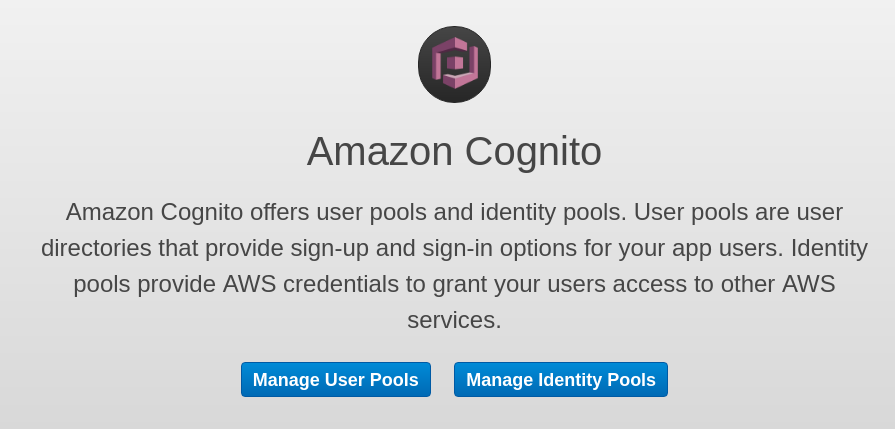

### step 2 
Click on the Create a User Pool button.
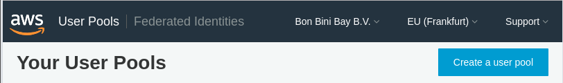

### step 3 
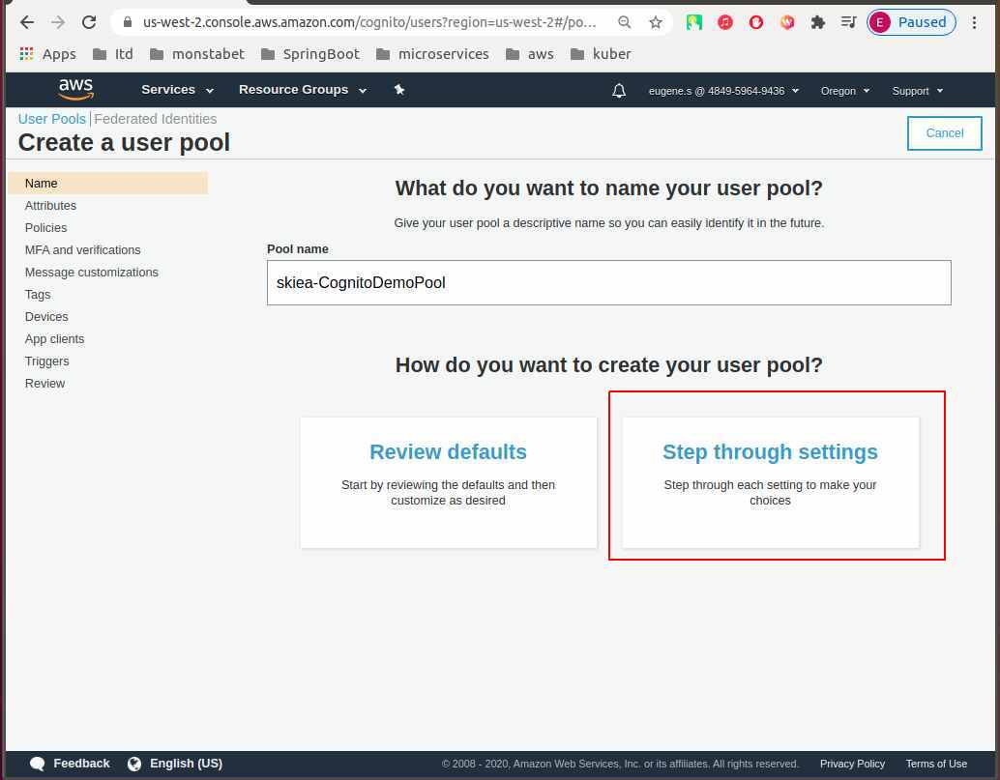
Click on the Step Through Setting button.

### step 4
* 4.1  Use the default value for the user name  
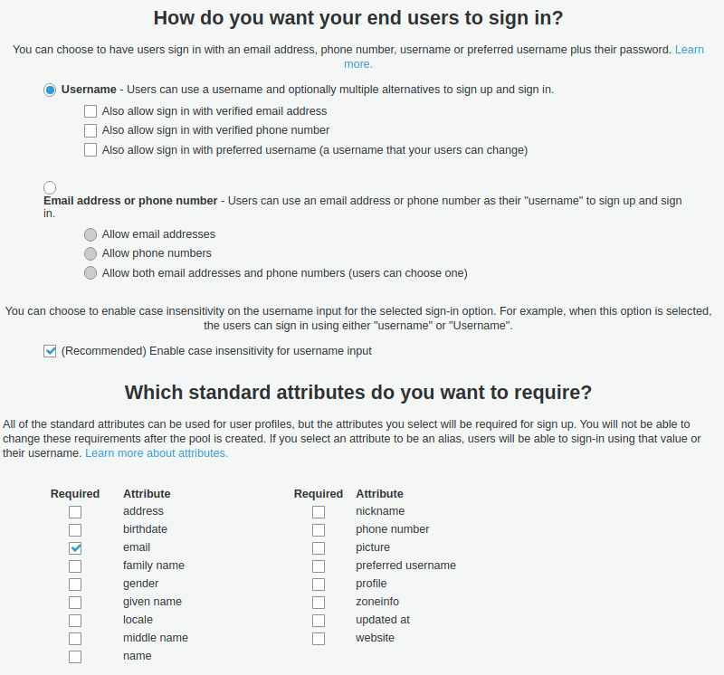
*  4.2 Add a custom attribute "location"
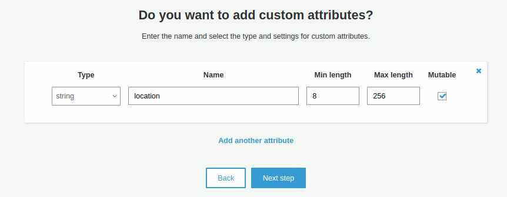

* 4.3 For the demonstration application, allow any eight character password 
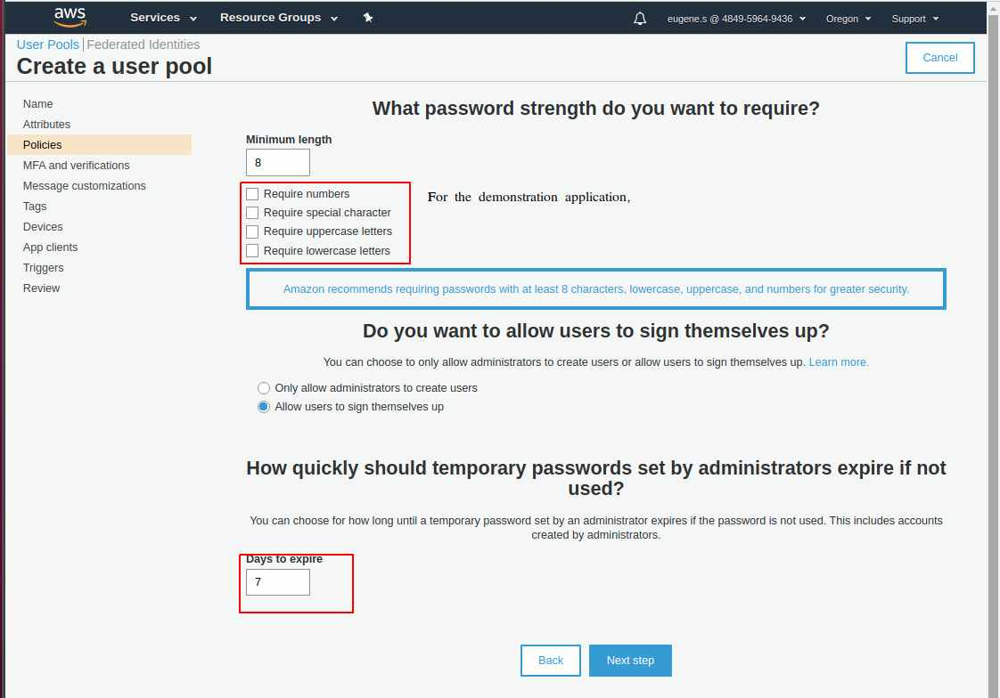

*  4.4. Next step
* Accept the defaults for the MFA and verification page and click Next Step


* 4.5 Accept the defaults for the message customization page (OK, if you want, you can customize the message). Click Next Step
* Don't add any tags and click Next Step


* 4.6 Accept the default for "remember the user's devices" (we're not using devices for this demo).

* 4.7 Click on Add an App Client. We will need a client for Cognito authentication. In this case the client will be the
Cognito demonstration Web app.
* 4.7.1 
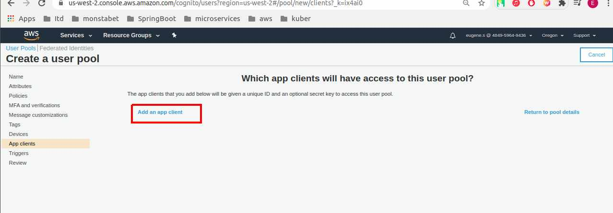
* 4.7.2  Fill in the client app form as shown below and click "Create Client App". Then click Next Step

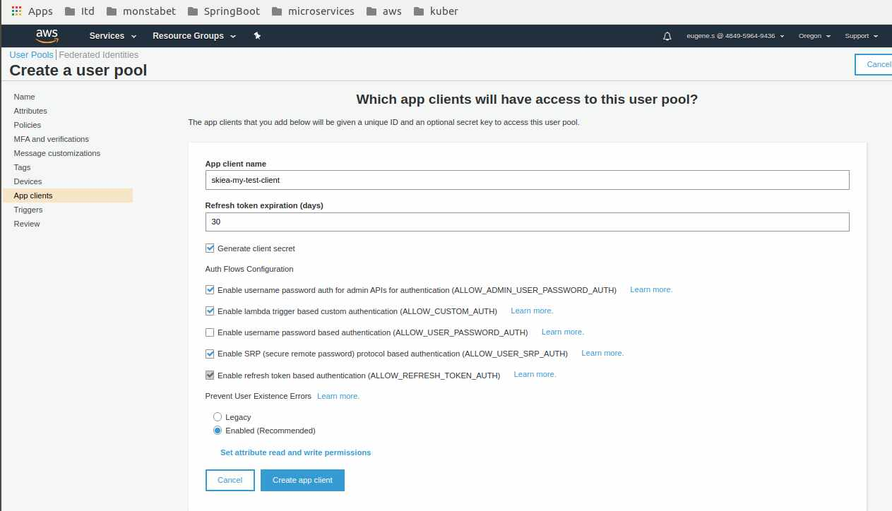

The app client id and secret will be available after you save this user pool.

* 4.8 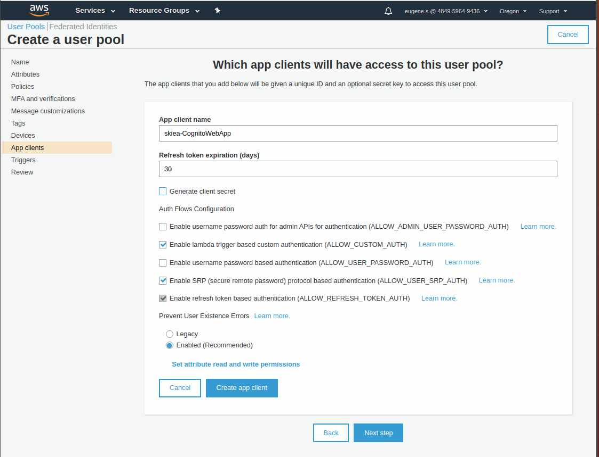

*4.9 Click Next Step for the triggers page. 

*4.10 Click the Create Pool button to create the user pool.
after all steps you will got **Pool ID** 
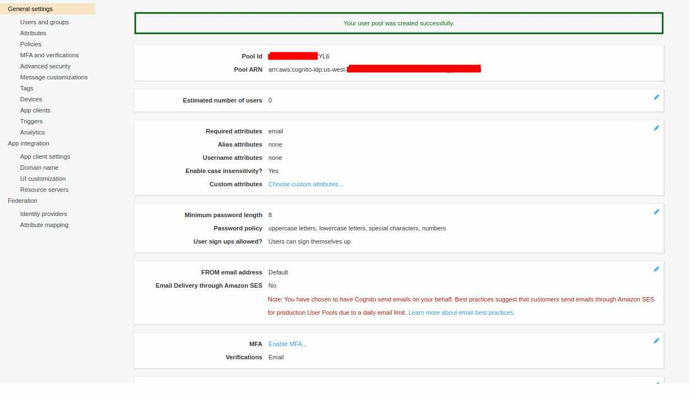

4.11 Pool id will be required for next steps 
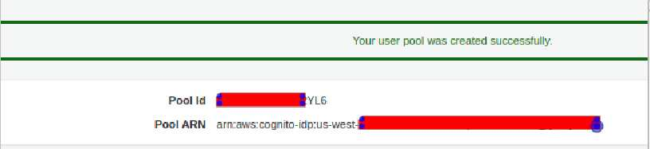

4.12 Client id will be required for next steps 
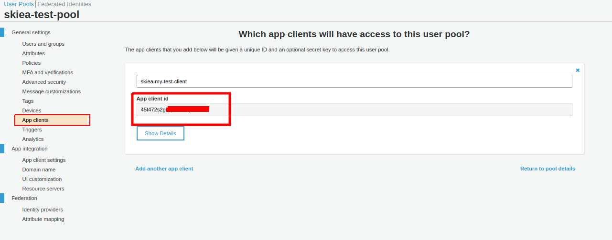


### Step 5 
* Sign in to the [Amazon Cognito console](https://us-west-2.console.aws.amazon.com/cognito/home?region=us-west-2)
*  Create an identity pool and configure it to integrate with the user pool.
User pool is step **4.10**
Client id is step **4.11**
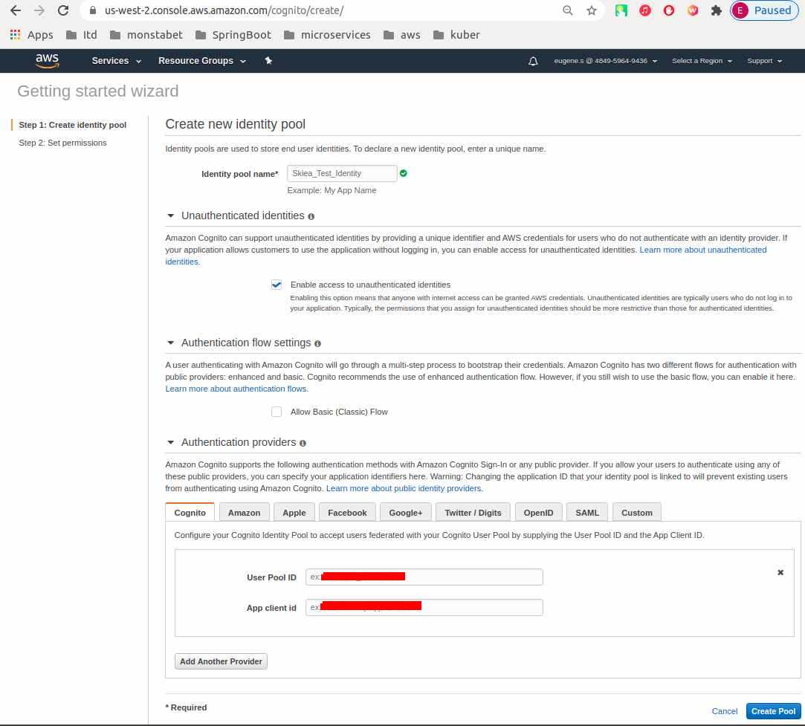

Set up 
User Pool ID
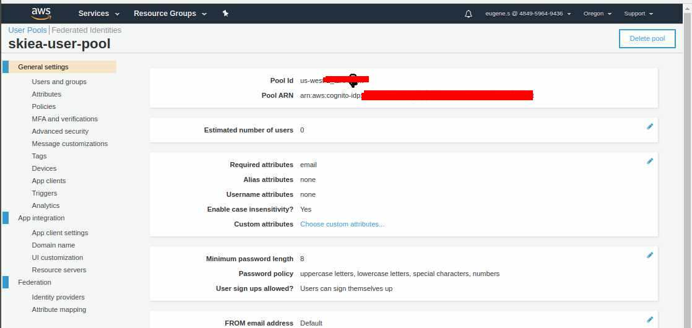

and App client id


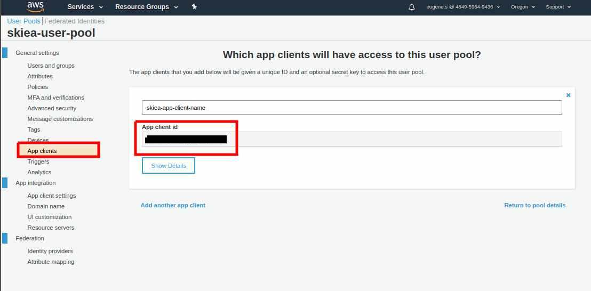

* click create pool

нажать аплай 
выйти на главную - зайти в  созлданный идентити пул и указать роли

edit identity pool
Identity pool ID 
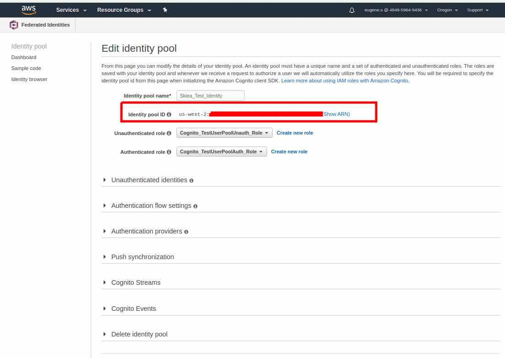


https://docs.aws.amazon.com/general/latest/gr/cognito_identity.html

cognito-idp.eu-west-2.amazonaws.com
