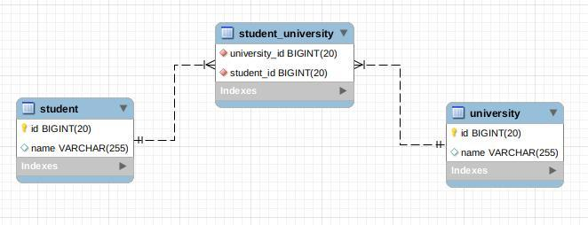

#@ManyToMany

Примером ассоциации @ManyToMany (многие-ко-многим) могут быть отношения студентов и ВУЗов. В одном институте может
 быть много студентов, студент может учиться в нескольких ВУЗах. Рассмотрим с начала таблицы БД 
 
 Список институтов в сущности Student аннотирован с помощью @ManyToMany. Далее следует аннотация @JoinTable, которая определяет таблицу и поля для связи. Параметр name указывает название таблицы (student_university). Параметр joinColumns указывает на поле, которое используется для прямой связи (идентификатор student_id). Параметр inverseJoinColumns указывает на поле, которое используется для обратной связи (идентификатор university_id). Для указания столбцов связи из таблицы используется аннотация @JoinColumn.
 
 Сущность университета University описана "зеркально"
 
 
 Без доп настроек будет сгенерена вспом таблица с нужными для связиполями 