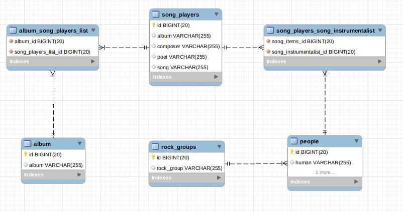

## Веб приложение, выполнено на Spring boot.

Предметная область – сервис для поиска музыкальных композиций, авторов, композиторов, исполнителей, альбомов, синглов, сборников. Ниже приводится список обязательных требований, которые нужно учесть в модели данных. Список атрибутов таблиц не приводится специально, нужно создать таблицы самостоятельно.

Требования которые нужно учесть:

Музыкальная композиция может быть исполнена разными исполнителями. Абсолютно разными в разные периоды времени, либо дуэтом, квартетом и т.д
Каждая музыкальная композиция должна иметь одного композитора и автора текста.
При этом исполнитель, композитор, автор могут быть одним и тем же человеком
Музыкальная композиция может выпускаться синглом, либо внутри альбома (список песен одного исполнителя или группы)
Исполнитель может быть либо группой, либо как отдельный человек.

----
## Db 

[Mapstruct – Custom mapping methods](
http://javadevcorner.com/mapstruct-custom-mapping-rest-operations)

http://localhost:8080/users/updateUser
{
    "name": "Elton Winsley",
    "role": "STAFF"
}