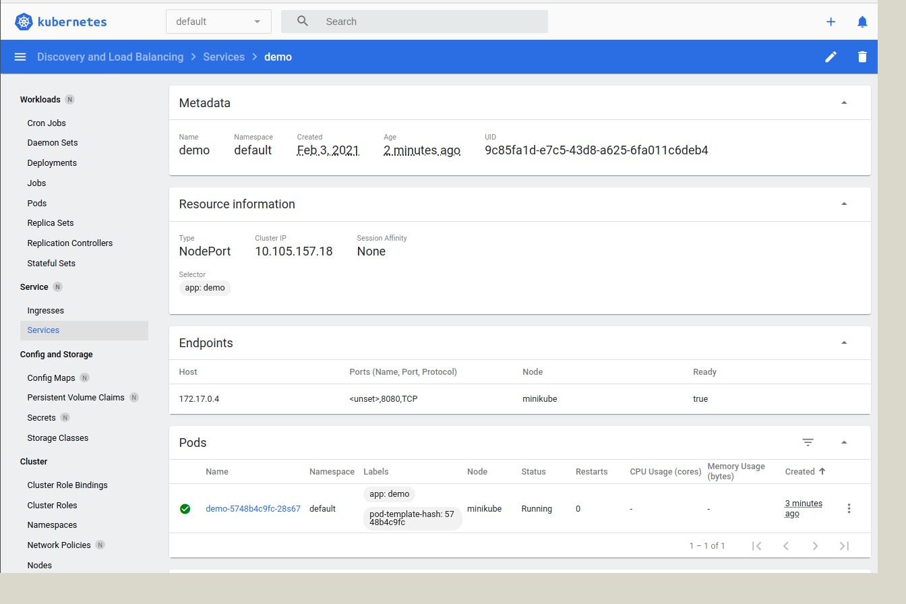

# Getting Started

###### Копируем исходники и  **компилируем в контейнере** при помощи gradle

Простое приложение на Spring Boot(**GRADLE**) в Docker-контейнере в поде K8s, который управляется через K8s deployment
 и доступен через сервис


## Technologies 

* spring, gradle 
* docker(FROM gradle:jdk10) 

## Docker 

### build image 
```bash
docker build -t sevad/hello-gradle-spring .
```

Check docker image 
```bash
docker container run -p 8080:8080  --name my_container sevad/hello-gradle-spring  
```

open terminal in runed container 
```bash
docker exec -ti  sevad/hello-gradle-spring /bin/bash
```


### push to docker hub 
```bash
  docker push sevad/hello-gradle-spring
```


## kuber 
Файл манифеста K8s тоже простой. Он состоит из развертывания (Deployment) и сервиса (Service):

kubectl create -f <yaml_file>


Deployment определяет две реплики пода, в которых будет выполняться контейнер, созданный из образа, указанного в атрибуте image.

У сервиса (Service) тип ClusterIP (тип сервиса по умолчанию). Он предоставляет внутри кластера возможность подключаться
 к нам другим приложениям.
 
 Создаем ресурсы в кластере:
 ```bash
   kubectl create -f k8s/depl.yaml
 ```

## TODO:
```
kubectl create -f k8s/test.yaml 
```~~~~

#### удалить деплоймент
```yaml
 kubectl delete  deploy demo
```

### verify whether the deployment 
```yaml
  minikube dashboard
```


### expose the Spring Boot application, run below command
 ```yaml
 kubectl expose deployment demo --type="NodePort" --port 8080
```

### Check is  a new service now available
go to Services section within Dashboard


  
 ### Note the ip address of Minikube
 ```bash
 minikube ip
```

192.168.49.2/greet/Docker

## Kubernetes support
 New yaml -> <ctrl> + <j>
 
 <ctrl> + <F12> File Structure
 ----------

# Part 2 

test.yaml содержит минимальный деплоймент и сервис. Достаточно запустить 
```bash
kubectl create -f k8s/test.yaml 
```
и получить адрес
```bash
 minikube service hello-world  --url
```
