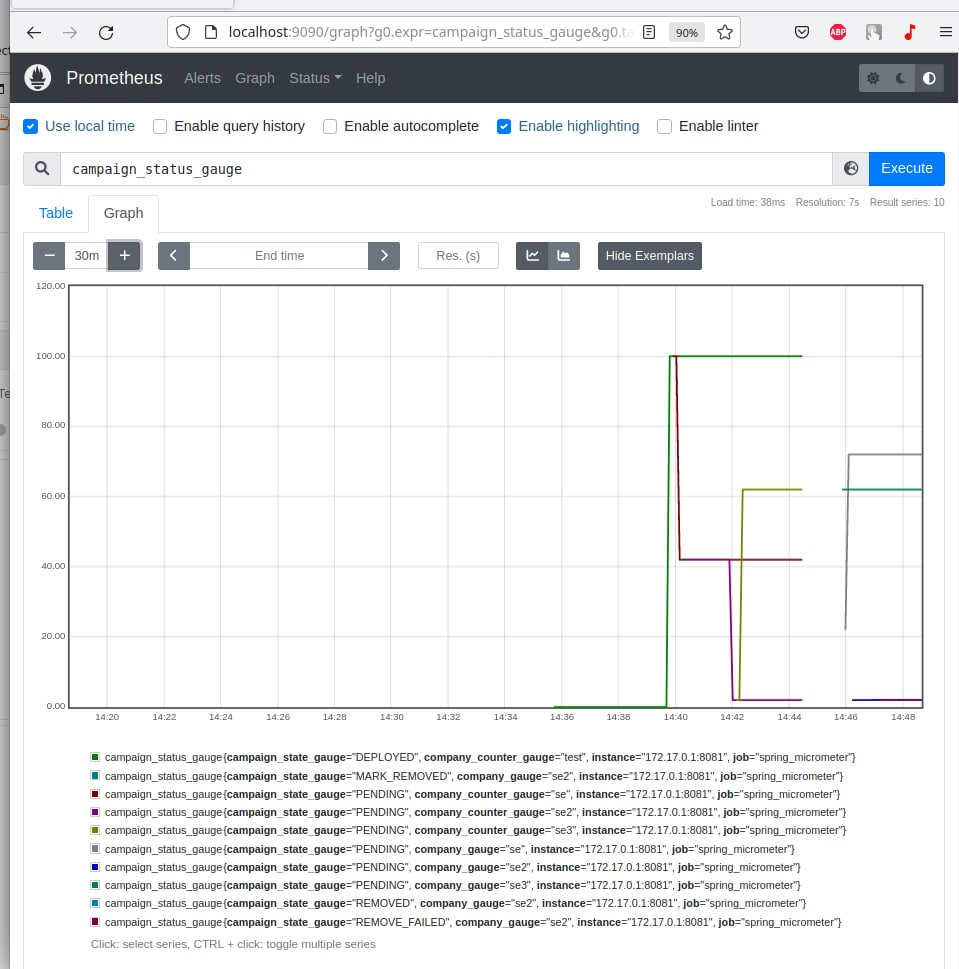

# Prometheus + Grafana demo project
## Prometheus
### все метрики 
```http request
    http://localhost:8081/actuator/prometheus
```
### Создать и запустить докер контейнер Promotheus
```bash
    docker run -d -p 9090:9090 \
    --name=my-prometheus \
     -v /home/softkit/Documents/projects/Learning/SeSpringBootPetProjects/metrics/demo-prometeus/src/main/resources/prometheus.yml:/etc/prometheus/prometheus.yml \
     prom/prometheus
```
### Запустить созданный контейнер 
```bash
    docker start my-prometheus
```

prometheus
```http request
    http://localhost:9090
```

#### Проверить источник метрик 
On bottom menu: Stautus-> target

## Grafana
### Создать и запустить докер контейнер
```bash
  docker run -d --name=my-grafana \
  -p 3000:3000 \
   grafana/grafana
```

### Запустить панее созданный контейнер
```bash
    docker start my-grafanas
```
#### Addiotional
разрешить для брандмаузера
```bah
sudo ufw allow from 172.17.0.0/24
```

base path
```http request
    http://localhost:3000
```
    admin/admin

http GET "http://localhost:8080/actuator/prometheus" | grep custom

## IncreaseCounterJob demo
есть несколько стран и несколько способов оплаты 
вместо точ=го чтобы использовать кучу счетчиков типа  Старана-способ-оплаты юзаем теги или лейблы
tags (as they are called in Micrometer) 
labels (the same concept in Prometheus)
устанавливаем соответствующие значения атрибутов каждый раз, когда мы его увеличиваем.

например
labels (e.g. country='DE', payment_method='INVOICE' and shipping_method='STANDARD').

#### как чекнуть
идем на актуатор 

```actuator
    http://localhost:8081/actuator/prometheus
```
ищем orders_country_total
```
# HELP orders_country_total  
# TYPE orders_country_total counter
у {country="RU",} 8.0
orders_country_total{country="UA",} 11.0
orders_country_total{country="US",} 11.0
```

в Prometheus
search -> orders_country_total

```
orders_country_total
```
вернет по каждому 

|||
| ----------- | ----------- |
|orders_country_total{country="RU", instance="172.17.0.1:8081", job="spring_micrometer"} |91|
|orders_country_total{country="UA", instance="172.17.0.1:8081", job="spring_micrometer"} |111|
|orders_country_total{country="US", instance="172.17.0.1:8081", job="spring_micrometer"} |99 |


##Campaign 

### all campaign 
```
campaign_status_total
```

### campaign with status PENDING
```
    campaign_status_counter_total{campaign_state="PENDING"}
```

### campaign by name 
```
 campaign_status_counter_total{company="test"}
```


### Postman

#### Multi counter 


```
curl --location --request POST 'http://localhost:8081/campaign-counter/increment' \
--header 'Content-Type: application/json' \
--data-raw '{
    "campaignName":"test",
    "campaignStatus":"DEPLOYED"
}'
```

### Gauages



все данные по кампаниям
change gauge : campaign_status_gauge
```
    curl --location --request POST 'http://localhost:8081/campaign-gauge/set-value' \
--header 'Content-Type: application/json' \
--data-raw '{
    "value":"62",
    "campaignName":"se3",
    "campaignStatus":"PENDING"
}'
```


данные по имени 
```
campaign_status_gauge{company_gauge="se"}
```
campaign_status_gauge{company_gauge="se2",campaign_state_gauge="PENDING" }


## Prometheus queries 
*rate*  function, which calculates the per-second average rate of increase of the time series in the range vector

```
HELP orders_created_total
# TYPE orders_created_total counter
orders_created_total 9.0
```

что для каждой метрики (например, счетчика) Prometheus создает отдельный вектор значений (называемый временными рядами) для каждой комбинации значений меток

посмотреть серию
```
    increase(orders_created_total{country="DE",payment_method="INVOICE",shipping_method="STANDARD"}[5m])
```


sum aggregation operator 
```
    sum(increase(orders_created_total[5m]))
```

sum aggregation by country 
```
    sum(increase(orders_created_total[5m])) by (country)
```


rate(orders_created_total{country="RU"}[1h]) * 60


rate(per_customer_per_type_total{customer="RU"}[black]) * 60


дополнительно
https://github.com/Kirya522/medium-posts/tree/main/java/spring-metrics/src/metricsdemo/scripts
---

https://mokkapps.de/blog/monitoring-spring-boot-application-with-micrometer-prometheus-and-grafana-using-custom-metrics/

---
https://www.innoq.com/en/blog/prometheus-counters/

---
https://tomgregory.com/the-four-types-of-prometheus-metrics/#counters

---
https://dzone.com/articles/spring-boot-metrics-with-dynamic-tag-values
( https://github.com/firedome/dynamic-actuator-metrics)
----